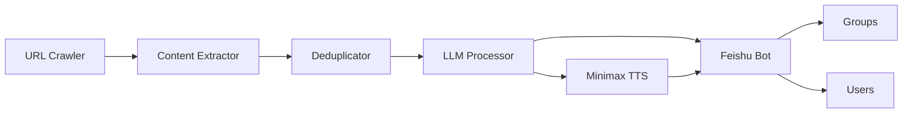

# AI Intelligence Radar

一个面向新闻聚合、智能筛选、播客生成和飞书推送的 Python 项目。系统从多个公开新闻源抓取 URL，提取正文，使用大语言模型完成筛选和内容生成，再按群组或个人兴趣分发。

## 功能

- 多站点新闻 URL 发现和正文提取
- 基于 URL、标题和内容的多层去重
- 使用 LLM 进行相关性评分、任务筛选和中文内容生成
- 按地区和主题生成群组播客脚本
- 可选 Minimax TTS，将脚本转换为 MP3/OPUS 音频
- 通过飞书应用或 Webhook 推送文本和音频
- 用户资料与密钥通过本地配置注入，不写入仓库

## 项目结构

```text
.
├── main.py
├── config/
│   └── users.example.json
├── docs/
│   ├── architecture.md
│   └── configuration.md
├── prompts/
├── scripts/
│   └── list_feishu_groups.py
├── src/
│   ├── application.py
│   ├── config.py
│   ├── crawlers/
│   ├── processing/
│   └── integrations/
│       ├── audio/
│       ├── feishu_bot.py
│       └── feishu_user_service.py
├── requirements.txt
└── .env.example
```

## 环境要求

- Python 3.10+
- FFmpeg（仅在生成 OPUS 音频时需要）

## 安装

```bash
python -m venv .venv
source .venv/bin/activate
pip install -r requirements.txt
```

## 配置

复制配置模板：

```bash
cp .env.example .env
cp config/users.example.json config/users.json
```

然后填写：

- `BLUE_CONVERSE_*`：LLM API 地址和密钥
- `FEISHU_*`：飞书应用凭据和各群组 Chat ID
- `MINIMAX_*`：可选的语音合成凭据
- `config/users.json`：个人用户及兴趣配置，该文件已被 Git 忽略

详细字段说明见 [docs/configuration.md](docs/configuration.md)。

## 运行

```bash
python main.py
```

运行产物写入以下本地目录，且不会进入 Git：

```text
data/          # 数据库、抓取结果和摘要
audio_files/   # 生成的音频
logs/          # 运行日志
```

## 查看飞书群组 ID

配置 `FEISHU_APP_ID` 和 `FEISHU_APP_SECRET` 后运行：

```bash
python scripts/list_feishu_groups.py
```

输出中的 Chat ID 应填写到本地 `.env`，不要提交到仓库。

## 架构



更完整的数据流和模块职责见 [docs/architecture.md](docs/architecture.md)。

## 安全

- 不要提交 `.env`、`config/users.json`、数据库或运行日志
- 凭据一旦出现在公开历史中，应立即吊销并轮换
- 示例文件只使用 `example.com` 和匿名占位符

## 许可证

MIT
