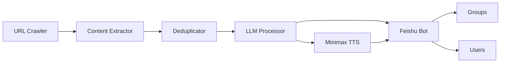

# AI Intelligence Radar

**Language:** [简体中文](README.md) | [English](README_EN.md)

AI Intelligence Radar is a Python application for news aggregation, intelligent
filtering, podcast generation, and Feishu delivery. It discovers articles from
public news sources, extracts their content, uses an LLM for filtering and
content generation, and distributes the results by group or user interests.

## Features

- Multi-source news URL discovery and article extraction
- Multi-layer deduplication based on URLs, titles, and content
- LLM-powered relevance scoring, task filtering, and Chinese content generation
- Region- and topic-specific group podcast scripts
- Optional Minimax TTS for MP3 and OPUS audio generation
- Text and audio delivery through Feishu applications or webhooks
- User profiles and credentials loaded from local configuration

## Project Structure

```text
.
├── main.py
├── README.md
├── README_EN.md
├── pyproject.toml
├── requirements.txt
├── requirements-dev.txt
├── SECURITY.md
├── .github/
│   └── workflows/ci.yml
├── config/
│   └── users.example.json
├── docs/
│   ├── architecture.md
│   └── configuration.md
├── prompts/
├── scripts/
│   └── list_feishu_groups.py
├── tests/
│   └── test_smoke.py
├── src/
│   ├── application.py
│   ├── config.py
│   ├── crawlers/
│   ├── processing/
│   └── integrations/
│       ├── audio/
│       ├── feishu_bot.py
│       └── feishu_user_service.py
└── .env.example
```

## Requirements

- Python 3.10+
- FFmpeg, required only for OPUS audio conversion

## Installation

```bash
python -m venv .venv
source .venv/bin/activate
pip install -r requirements.txt
```

## Configuration

Create local configuration files from the templates:

```bash
cp .env.example .env
cp config/users.example.json config/users.json
```

Configure the following values:

- `BLUE_CONVERSE_*`: LLM API endpoint and credentials
- `FEISHU_*`: Feishu application credentials and group Chat IDs
- `MINIMAX_*`: optional text-to-speech credentials
- `config/users.json`: user interests and delivery settings, ignored by Git

Detailed configuration is available in
[docs/configuration.md](docs/configuration.md). The current detailed documents
are written in Chinese.

## Development and Quality Checks

Install the development dependencies:

```bash
make install
```

Run static checks, formatting checks, and unit tests:

```bash
make check
```

The commands can also be run individually:

```bash
ruff check src tests main.py scripts
ruff format --check src tests main.py scripts
python -m unittest discover -s tests -v
```

CI runs these checks with Python 3.10 and 3.12.

## Running

```bash
python main.py
```

Runtime output is written to local directories that are excluded from Git:

```text
data/          # Databases, crawl results, and summaries
audio_files/   # Generated audio files
logs/          # Application logs
```

## Listing Feishu Group IDs

After configuring `FEISHU_APP_ID` and `FEISHU_APP_SECRET`, run:

```bash
python scripts/list_feishu_groups.py
```

Add the resulting Chat IDs to your local `.env` file. Do not commit them.

## Architecture



See [docs/architecture.md](docs/architecture.md) for the data flow and module
responsibilities. The current detailed documents are written in Chinese.

## Security

- Never commit `.env`, `config/users.json`, databases, or runtime logs.
- Revoke and rotate any credential that appears in public history.
- Example files use only `example.com` and anonymous placeholders.
- See [SECURITY.md](SECURITY.md) for the security policy.

## License

MIT
